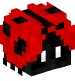

# 神秘精灵

SoTap 探险队在危险重重的世界边境发现了一种神秘的精灵，它来自远古，拥有神奇的魔力。SoTap科学实验室进一步研究发现，它可以带给玩家神秘的加成以及更多能力！它们以方块的形式存在，这使得他们可以摆放，和随身携带，极具收藏价值。

!> 有迹象表明，探险队发现的只是冰山一角，随着深入边境的探索，还会有更多未知精灵等待发现！

## 详细说明

### 精灵等级划分

远古的精灵宗族就像古代时候人类社会一样分三六九等，精灵有5个等级划分：

1. `Common`：普通
2. `Rare`：稀有
3. `Super Rare`：极稀有
4. `Legendary`：传奇
5. `Mythical`：神秘

!> 精灵的品质等级从`普通`到`神秘`依次升高，`神秘`为最高级的品质。品质越高级，精灵对应的能力也就越特殊，以及实用。

### 精灵图鉴

这里会按照其品质等级列出当前发现的所有精灵，并列出他们所拥有的已知能力。

|                     图片                     | 品质等级 |         精灵          |                          能力                           |
| :------------------------------------------: | :------: | :-------------------: | :-----------------------------------------------------: |
|                |   普通   |       兔 Rabbit       |           跳跃提升 - 让玩家获得`跳跃提升`效果           |
|                      |    -     |        蜂 Bee         |            鲜花之力 - 给玩家一朵随机品种的花            |
|              |    -     |     瓢虫 Ladybug      |           生命恢复 - 让玩家获得`生命恢复`效果           |
|                      |    -     |        猪 Pig         |               培根之树 - 在玩家周围生成猪               |
|                    |    -     |        鱼 Fish        |              鳃 - 让玩家获得`水下呼吸`效果              |
|                    |    -     |       点心 Cake       |             糖果碰撞 - 将玩家的饥饿度恢复满             |
|                      |    -     |        猫 Cat         |               逃离 - 让玩家拥有`速度`效果               |
|    |   稀有   |  甲虫 Horned Beetle   |            冲刺 - 将玩家向看向的方向发射出去            |
|          |    -     |    鸡宝 Baby Chick    |          缓降 - 让玩家短暂的获得几秒`缓降`效果          |
|            |    -     |     村民 Villager     |           交易 - 让玩家随机的获得一些交易内容           |
|  |    -     | 合成台 Crafting Table |     建筑大师 - 无需放置一个合成台即可打开合成台面板     |
|        |    -     |   末影箱 Enderchest   |       携带 - 无需放置一个末影箱即可打开末影箱面板       |
|                      |    -     |        狗 Dog         | 捕获 - 随机捕捉玩家50格范围内的一只羊并将其带到玩家面前 |
|              |  极稀有  |   企鹅 Mr. Penguin    |             雪球枪手 - 像手枪一样发射雪球吧             |
|                |    -     |      磁铁 Magnet      |     万物可吸 - 自动拾起玩家身边一定范围内的所有物品     |
|            |    -     |    末影人 Enderman    |       传送 - 发射一道光线，将玩家传送到光线的末端       |
|                    |   传奇   |       狮子 Lion       |    河东狮吼 - 杀死玩家周围一定范围内除玩家的所有生物    |
|              |    -     |    长颈鹿 Giraffe     |           消化 - 吃树叶并给予玩家一个随机物品           |
|                |    -     |      骑士 Knight      |       战吼 - 让玩家拥有`速度`、`力量`和`抗性提升`       |
|            |    -     |     狼人 WereWolf     |    鲜血渴望 - 用红色光环标记50格范围内的所有被动生物    |
|                |   神秘   |     独角兽 Unicon     |           飞行 - 让玩家短时间内获得飞行的能力           |
|                  |    -     |     游戏者 Gamer      |  游戏时间到！ - 搜寻玩家周围一定范围内的矿物并将其高亮  |
